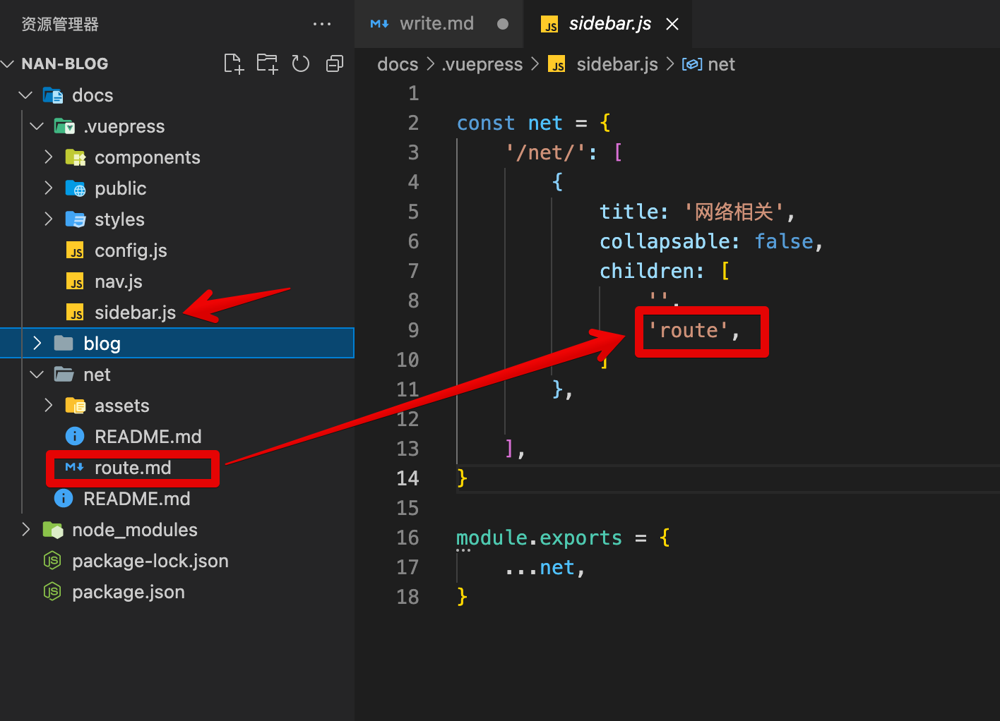

## 新建页面
:::: tabs
::: tab label=新建博客
* 博客不需要左侧目录，直接写就行，写好顶部的`font-matter`就能找到
>blog/2022/yuandan.md
```md{1-8}
---
title: 元旦
date: 2022-01-01
tags:
 - 生活
categories:
 - 个人日记
---

## 早上
* 早上我们去吃饭了
## 中午
* 中午我敲了这行代码
```


:::
::: tab label=需要目录的知识点
* 如果需要弄一个有目录的知识点，就需要配置
>.vuepress/sidebar.js
```js{8}
const net = {
    '/net/': [
        {
            title: '网络相关',
            collapsable: false,
            children: [
                '',
                'route',
            ]
        },

    ],
}
```


* 效果

:::
::::

## markdown语法

首先文档支持所有的markdown语法，包括各级标题、音视频解析、段落、列表、区块、代码、连接、表格，以及一些高级的编写技巧。

:::: tabs

::: tab label=标题
``` md
# 一级标题

###### 六级标题
```
# 一级标题

###### 六级标题
:::

::: tab label=多媒体

```md
视频：
<video controls width="700px">
    <source type="video/mp4" src="./assets/storybook.mp4">
</video>

图片：


音频：
<audio id="audio" controls>
    <source id="mp3" src="http://xxxx.mp3">
</audio>
```

> tip: 多媒体上下最好多加一个空行，否则容易导致语法错误

视频：
<video controls width="700px">
    <source type="video/mp4" src="./assets/storybook.mp4">
</video>

图片：  


音频：
<audio id="audio" controls>
    <source id="mp3" src="http://xxxx.mp3">
</audio>
:::

::: tab label=段落
``` md
末尾无空格回车不换行
不换行

末尾有两个空格+回车代表换行  
换行了

***
*斜体文本*
_斜体文本_
**粗体文本**
__粗体文本__
***粗斜体文本***
___粗斜体文本___
~~删除线~~
<u>下划线</u>
`关键字`
```

末尾无空格回车不换行
不换行

末尾有两个空格+回车代表换行  
换行了

*** 
*斜体文本*
_斜体文本_
**粗体文本**
__粗体文本__
***粗斜体文本***
___粗斜体文本___
~~删除线~~
<u>下划线</u>
`关键字`
:::

::: tab label=列表
``` md
* 第一项
* 第二项
* 第三项
***
1. 第一项
2. 第二项
3. 第三项
***
1. 第一项：
    - 第一项嵌套的第一个元素
    - 第一项嵌套的第二个元素
2. 第二项：
    - 第二项嵌套的第一个元素
    - 第二项嵌套的第二个元素
```

* 第一项
* 第二项
* 第三项
***
1. 第一项
2. 第二项
3. 第三项
***
1. 第一项：
    - 第一项嵌套的第一个元素
    - 第一项嵌套的第二个元素
2. 第二项：
    - 第二项嵌套的第一个元素
    - 第二项嵌套的第二个元素
:::

::: tab label=区块
``` md
> 最外层
> > 第一层嵌套
> > > 第二层嵌套
```
> 最外层
> > 第一层嵌套
> > > 第二层嵌套
:::

::: tab label=代码


```js {2}
code
code
code
```
:::

::: tab label=链接
``` md
[百度一下](https://www.baidu.com)
```
[百度一下](https://www.baidu.com)
:::

::: tab label=表格
``` md
|  表头   | 表头  |
|  ----  | ----  |
| 单元格  | 单元格 |
| 单元格  | 单元格 |
```
|  表头   | 表头  |
|  ----  | ----  |
| 单元格  | 单元格 |
| 单元格  | 单元格 |
:::

::::
## 已支持插件
### tip
```md
::: tip
这是一个提示
:::

::: warning
这是一个警告
:::

::: danger
这是一个危险警告
:::

::: details
这是一个详情块，在 IE / Edge 中不生效
:::
```
::: tip
这是一个提示
:::

::: warning
这是一个警告
:::

::: danger
这是一个危险警告
:::

::: details
这是一个详情块，在 IE / Edge 中不生效
:::

### tabs
```md
:::: tabs

::: tab label=组件概览
这是tabA 展示的页面
:::

::: tab label=详细介绍
这是tabB 展示的页面
:::

::::
```

:::: tabs

::: tab label=组件概览
这是tabA 展示的页面
:::

::: tab label=详细介绍
这是tabB 展示的页面
:::

::::

::: tip
更多参数请查看[element-ui官网](https://element.eleme.cn/#/zh-CN/component/tabs)
:::

### steps
```md
:::: steps

::: step
第一步  
第一步
:::

::: step
第二步  
第二步
:::

::: step
第三步  
第三步
:::

::: step
第四步  
第四步
:::

::::
```

:::: steps

::: step
第一步  
第一步
:::

::: step
第二个步  
第二个步
:::

::: step
第三步  
第三步
:::

::: step
第四步  
第四步
:::

::::
### 名人名言
```shell
:::: theorem
每天都要很开心

::: right
南瓜
:::
::::
```
:::: theorem
每天都要很开心

::: right
南瓜
:::
::::